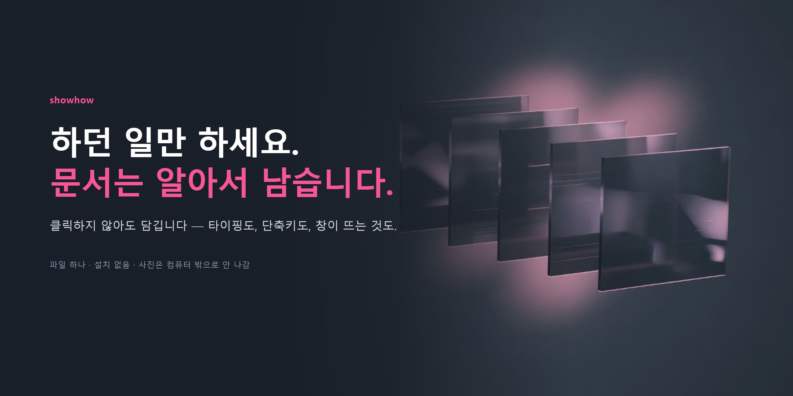
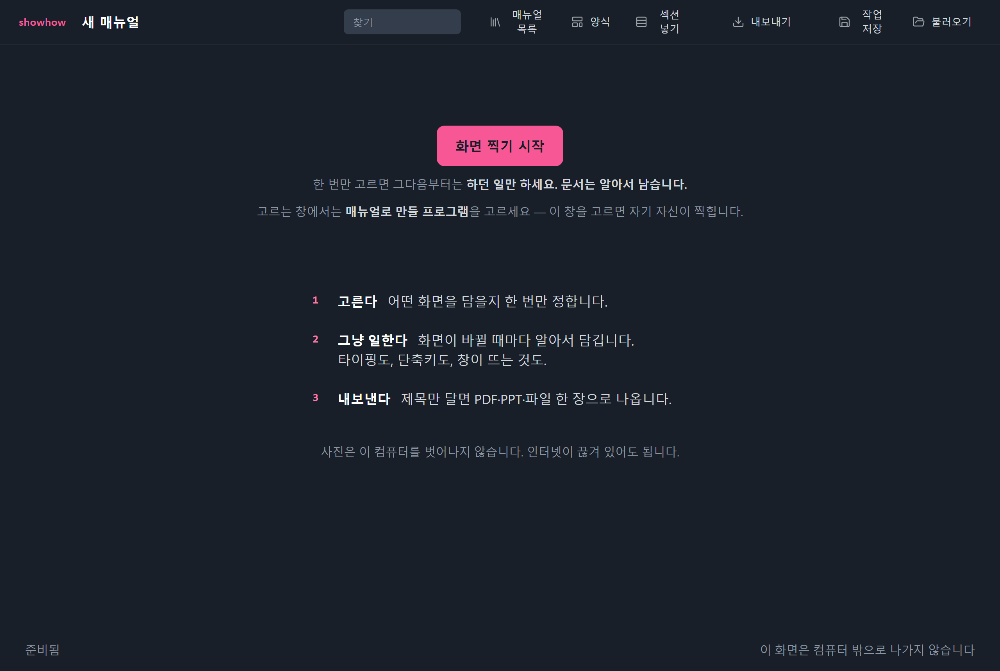
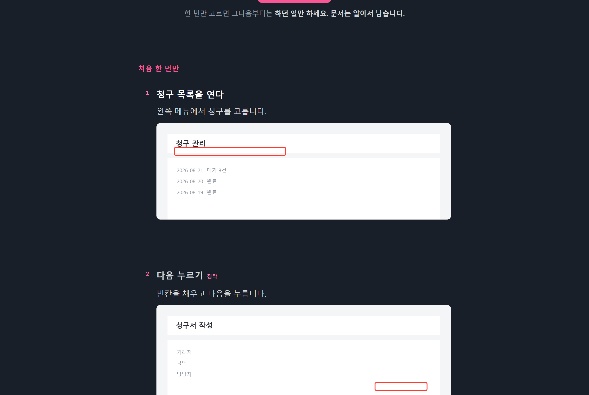
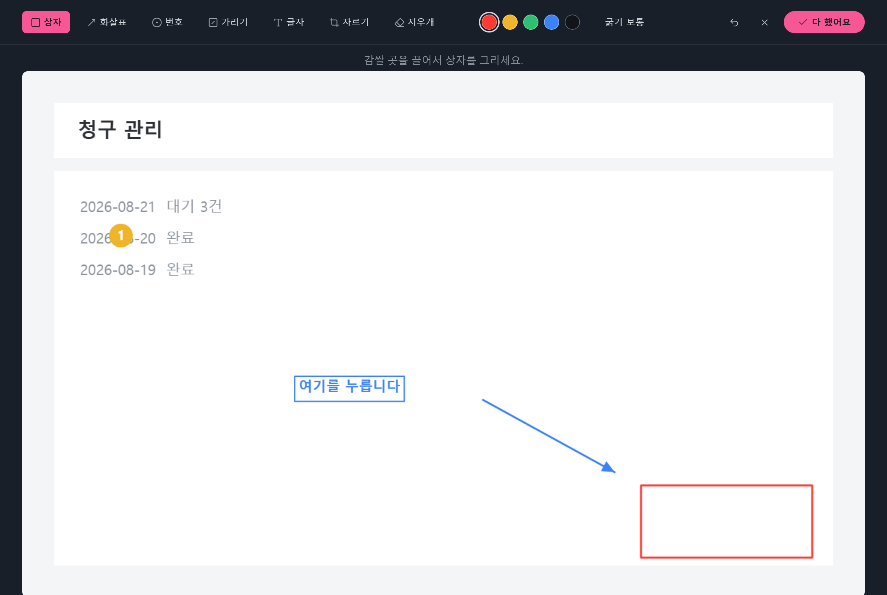
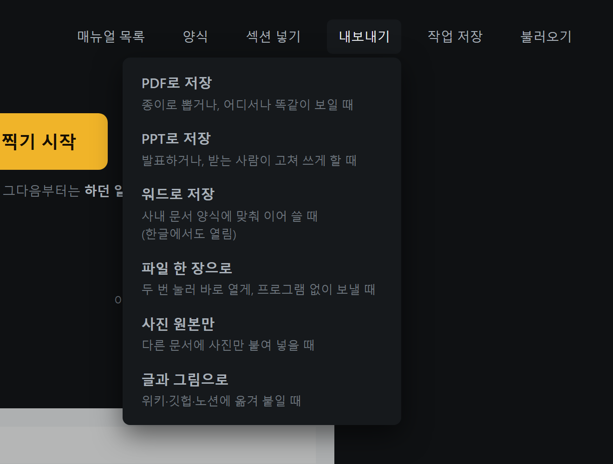
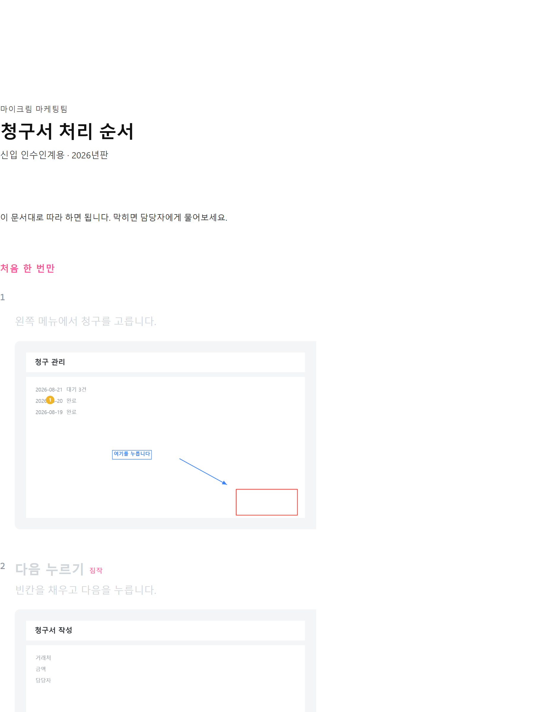
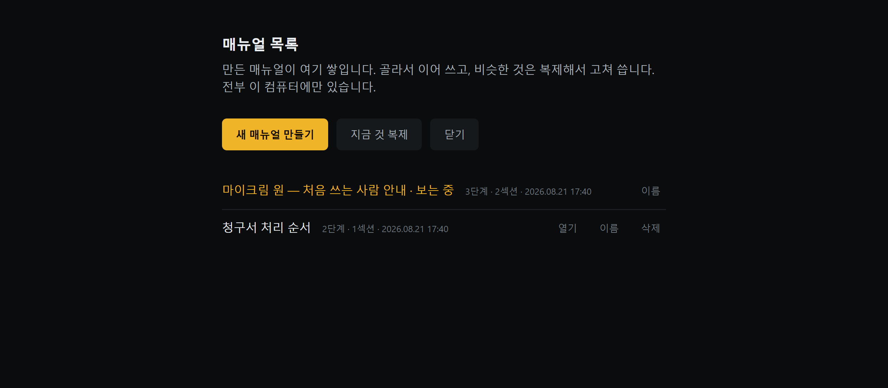
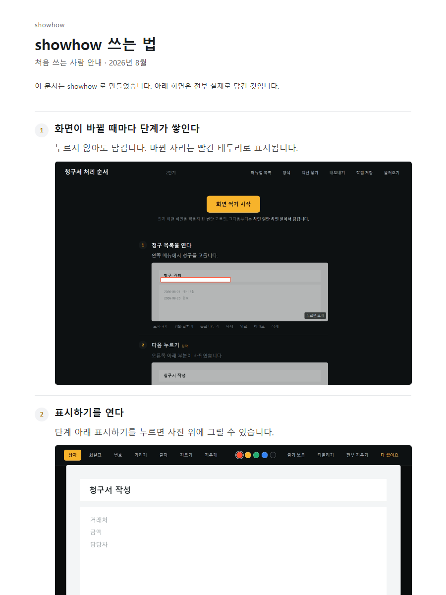

# showhow

**찍는 걸 잊어도 매뉴얼이 남습니다.** 업무 화면을 자동으로 담아 PDF·PPT로 내보내는, 브라우저 파일 하나짜리 도구입니다.

[English](README.en.md) · [바로 써보기](https://svy04.github.io/showhow/) · [파일로 내려받기](https://github.com/svy04/showhow/raw/main/index.html)

- **클릭 없이도 담깁니다.** 타이핑, 단축키, 창이 뜨는 것, 로딩이 끝나는 것까지 화면이 바뀌면 담깁니다.
- **멈출 때 한 장씩만 담깁니다.** 커서가 지나가거나 영상이 도는 동안에는 담지 않습니다.
- **놓친 순간을 되살립니다.** 안 담긴 화면도 최근 것은 되감아 꺼낼 수 있습니다.
- **PDF·PPT·워드·파일 한 장으로 내보냅니다.** 파워포인트와 워드 파일은 받은 사람이 그대로 고쳐 쓸 수 있습니다.
- **받는 사람에 따라 잘라 냅니다.** 섹션을 빼면 그 섹션은 내보내기에서 통째로 빠집니다.
- **사진이 컴퓨터를 벗어나지 않습니다.** 서버로 보내는 코드가 없습니다. 인터넷이 끊겨도 됩니다 (제목 자동 작성만 예외 — 아래 참조).
- **제목 초안을 대신 씁니다.** 바뀐 자리의 글자를 읽어 「다음 누르기」처럼 채웁니다. 흔한 단추 64개로 재서 **44개를 맞혔습니다**(틀림 10 · 빈칸 10). 읽는 일도 이 컴퓨터 안에서 합니다.
- **검사 293건이 통과한 상태로 배포합니다.** 그중 190건은 진짜 브라우저에서, 10건은 진짜 화면 공유로 돌립니다.

## 30초 만에 써 보기

1. [index.html 을 내려받습니다](https://github.com/svy04/showhow/raw/main/index.html). 또는 [바로 써보기](https://svy04.github.io/showhow/)로 여십시오.
2. 두 번 눌러 크롬이나 엣지로 엽니다.
3. **화면 찍기 시작** 을 누르고, 어떤 화면을 담을지 한 번 고릅니다.
4. 그다음부터는 하던 일만 합니다.



## 무엇이 다른가

화면 캡처형 매뉴얼 도구는 대부분 **클릭이 있어야 사진이 생깁니다.**

> "StepCapture records cursor clicks and drags, but does not capture non-click actions, such as text entry or keyboard shortcuts." — Snagit 공식 문서

> "Recorded steps don't capture anything that's typed during the recording." — Microsoft 단계 기록기 공식 문서

그래서 다 만들고 나서 보면 빠진 단계가 생깁니다. 편집이 늦어서가 아니라, 그 순간 클릭이 없어 사진이 아예 안 만들어졌기 때문입니다.

showhow 는 클릭 대신 **화면이 얼마나 바뀌었는지** 를 봅니다. 초당 7번 화면을 비교해서, 크게 바뀌기 시작한 뒤 **0.7초 동안 그대로면** 한 장을 담습니다.

0.7초를 세는 이유가 있습니다. 화면 공유는 초당 다섯 장을 보내는데 우리는 초당 일곱 번 보기 때문에, 같은 장면을 두세 번 다시 보는 일이 늘 생깁니다. 그것을 "멈췄다"로 읽으면 영상이 도는 내내 사진이 쌓입니다. 그래서 횟수가 아니라 시계로 잽니다.

| 무엇을 할 때 | 클릭으로 찍는 도구 | showhow |
|---|---|---|
| 버튼을 누른다 | 담김 | 담김 |
| 칸에 글자를 친다 | 안 담김 | 담김 |
| 단축키를 누른다 | 안 담김 | 담김 |
| 창이 뜨거나 로딩이 끝난다 | 안 담김 | 담김 |
| 커서만 지나간다 | 담김 (지워야 함) | 안 담김 |
| 영상이 돌아간다 | 계속 담김 | 안 담김 |

한 번에 오래 움직인 화면은 3초 동안 "영상"으로 기억해 두고, 그동안은 1.5초를 기다립니다. 그래서 스크롤이나 영상에서 사진이 쌓이지 않습니다.

화면이 너무 오래 쉬지 않아 담지 못하고 있으면 그렇게 말해 줍니다. 그때는 <kbd>Space</kbd> 로 직접 찍으면 됩니다.

## 담긴 것을 다듬는다

담기는 동안 오른쪽 목록에 쌓입니다. 제목만 달면 문서가 됩니다.



바뀐 자리는 빨간 테두리로 표시되고, 설명 칸에는 `오른쪽 아래 부분이 바뀌었습니다` 같은 길잡이가 흐리게 뜹니다. 길잡이는 예시일 뿐이라 내보낼 때 문서에 들어가지 않습니다.

### 제목은 초안까지 나옵니다

**제목 자동 작성**을 켜면 바뀐 자리의 글자를 읽어 「다음 누르기」처럼 제목을 채웁니다. 채운 제목에는 **짐작** 표시가 붙습니다 — 읽은 것이지 안 것이 아니기 때문입니다.

얼마나 맞히는지 재 두었습니다. 흔한 단추 16개를 크기 네 가지로 그려 64번 시켰습니다.

| | 맞음 | 틀림 | 빈칸 |
|---|---|---|---|
| 전체 64개 | 44 | 10 | 10 |
| 한글 40개 | 26 | — | — |
| 영어 24개 | 18 | — | — |

`node tests/검사_제목.mjs` 로 직접 다시 잴 수 있습니다. 이 숫자가 나빠지면 검사가 걸러 냅니다.

한 단계에서 할 수 있는 것:

- **표시하기** — 상자·화살표·번호·글자를 넣고, 가려야 할 곳은 덮고, 사진을 잘라 냅니다. 색 다섯 가지, 굵기 세 단계, 표시 하나만 지우는 지우개.
- **위와 합치기 / 둘로 나누기 / 복제** — 한 동작이 두 장으로 찍혔거나 그 반대일 때.
- **끌어서 옮기기** — 번호 동그라미를 잡고 끕니다. 두 번 누르면 맨 위로. Ctrl+Z 로 되돌립니다.
- **섹션 넣기** — 단계를 묶고, 받는 사람에 따라 통째로 뺍니다.



## 내보낸다



| 무엇으로 | 언제 씁니까 |
|---|---|
| PDF | 종이로 뽑거나, 어디서나 똑같이 보이게 보낼 때 |
| PPT | 발표하거나, 받는 사람이 고쳐 쓰게 할 때 |
| 워드 | 사내 문서 양식에 맞춰 이어 쓸 때 (한글에서도 열립니다) |
| 파일 한 장 | 두 번 눌러 바로 열게, 프로그램 없이 보낼 때 |
| 사진 원본 | 다른 문서에 사진만 붙여 넣을 때 |
| 글과 그림 | 위키·깃헙·노션에 옮겨 붙일 때 |

파워포인트와 워드 파일은 외부 라이브러리 없이 직접 만듭니다. 만든 XML 이 문법에 맞는지 검사에서 실제로 파싱해 확인합니다.

PDF 는 브라우저 인쇄를 씁니다. 한글이 그림이 아니라 글자로 들어가서 복사·검색이 됩니다.



## 회사 양식을 저장한다

표지, 머리말, 맺음말을 양식으로 저장해 두고 매번 불러 씁니다. 부서마다 다른 양식을 `.manualform.json` 파일로 주고받을 수 있습니다.

매뉴얼이 여러 개면 목록에서 골라 이어 씁니다. 비슷한 것은 복제해서 고쳐 씁니다.



## 어디에 저장됩니까

| 무엇이 | 어디에 | 언제까지 |
|---|---|---|
| 지금 쓰던 것 | 브라우저 저장칸 | 브라우저 기록을 지우면 사라집니다 |
| 매뉴얼 목록 | 브라우저의 큰 저장칸(IndexedDB) | 같음 |
| 작업 파일 | 내가 고른 폴더 | 내가 지울 때까지 |

브라우저 저장칸이 차면 화면 위에 경고가 뜹니다. **작업 저장** 으로 파일을 뽑아 두면 안전합니다.

중요한 매뉴얼은 작업 파일로 뽑아 두십시오. 브라우저 저장칸은 백업이 아닙니다.

## 밝혀 둘 것 여섯 가지

1. **제목 자동 작성만 주소로 열었을 때 됩니다.** 글자를 읽는 파일이 `ocr/` 폴더에 따로 있어서, 내려받은 `index.html` 하나만으로는 브라우저가 옆 폴더 읽기를 막습니다. [바로 써보기](https://svy04.github.io/showhow/) 로 열거나 저장소를 통째로 받아 회사 안 서버에 두면 됩니다. 이때도 사진은 나가지 않습니다 — 글자 읽기까지 이 컴퓨터 안에서 합니다.
2. **크롬·엣지에서 검사했습니다.** 파이어폭스·사파리에서는 돌려보지 않았습니다. 확인하려면 그 브라우저로 열고 `tests/검사_촬영.mjs` 가 하는 절차를 손으로 밟으면 됩니다.
3. **화면 고르기 창은 사람이 한 번 눌러야 열립니다.** 브라우저 규칙이라 프로그램이 대신 누를 수 없습니다. `tests/검사_진짜공유.mjs` 는 그 창까지 브라우저 실행 옵션으로 자동으로 고르게 해서, 대역 없이 진짜 화면 신호로 돌립니다.
4. **고른 화면에 이 창이 보이면 자기 자신이 찍힙니다.** 한 장 담길 때마다 목록이 길어져 화면이 또 바뀌기 때문입니다. 실측으로는 사진 3장쯤에서 저절로 멎고, 더 빠르게 이어지면 자동 촬영을 끄고 이유를 알려 줍니다.
5. **링크로 공유하는 기능은 없습니다.** 서버가 없기 때문입니다. 대신 **파일 한 장으로** 를 쓰면 받는 사람이 두 번 눌러 바로 엽니다.
6. **소리와 영상은 담지 않습니다.** 화면 사진과 글만 남습니다.

## 검사를 직접 돌린다

```bash
git clone https://github.com/svy04/showhow.git
cd showhow
node tests/검사_전체.mjs        # 브라우저 없이 도는 검사 66건

npm i -D playwright             # 브라우저 검사를 돌리려면
npx playwright install msedge
node tests/검사_전부.mjs        # 전부 293건
```

돌리면 이렇게 나옵니다.

```
통과    검사_전체.mjs           66건    0.3초   브라우저 없이 도는 뼈대 검사
통과    검사_양식.mjs            6건    0.2초   양식 저장·불러오기
통과    검사_기능표.mjs          31건    0.2초   상용 제품 기능 대조
통과    검사_브라우저.mjs        131건   18.1초   진짜 브라우저 — 내보내기·보관함·표시·손질·규모
통과    검사_촬영.mjs           23건   30.2초   진짜 브라우저 — 자동 촬영 전 과정
통과    검사_인쇄.mjs            8건      3초   진짜 브라우저 — PDF 출력
통과    검사_제목.mjs           18건   13.8초   단계 글 자동 작성 — 화면 글자 읽기
통과    검사_진짜공유.mjs         10건     27초   대역 없이 진짜 화면 공유 (창이 잠깐 뜬다)

합계 293건 통과 · 실패 없음
```

`tests/검사_기능표.mjs` 는 상용 제품이 가진 기능 26가지를 이 코드가 실제로 갖고 있는지 파일에서 확인합니다. 사람 기억이 아니라 파일이 근거입니다.

`tests/검사_진짜공유.mjs` 는 대역을 하나도 쓰지 않습니다. 진짜 `getDisplayMedia` 가 돌려주는 진짜 화면 신호로 담고, 자기 자신을 찍는 고리까지 실제로 만들어 봅니다.

## 고치고 싶다면

`index.html` 한 파일에 전부 들어 있습니다. 빌드 도구를 쓰지 않으니 열어서 고치고 브라우저에서 새로 고치면 됩니다.

바깥에서 가져온 것은 하나뿐입니다 — 글자 읽기(`ocr/`, [Tesseract](https://github.com/naptha/tesseract.js), Apache-2.0). 인터넷으로 부르지 않고 저장소 안에 넣어 두었습니다.

<details>
<summary>안에 무엇이 들어 있나</summary>

| 자리 | 하는 일 |
|---|---|
| `startCapture` | 화면 공유를 한 번 허락받고 계속 씁니다 |
| `watchTick` | 240×150 으로 줄여 픽셀을 비교하고, 담을 순간을 정합니다 |
| `busyScreen` | 방금까지 오래 움직인 화면인지 시계로 기억합니다 |
| `loopWatch` | 자기 자신을 찍는 고리를 끊습니다 |
| `changedBox` · `spotWiden` | 바뀐 자리를 찾아 상자로 잡습니다 |
| `REWIND` | 최근 화면을 90장까지 들고 있다가 되살립니다 |
| `exportPPT` · `exportDOCX` | 압축 파일과 OOXML 을 직접 만들어 `.pptx` · `.docx` 를 씁니다 |
| `exportHTML` · `exportMD` | 사진까지 박힌 한 장짜리 문서 / 글과 그림 묶음 |
| `ocrCrop` · `ocrTitle` | 바뀐 자리를 잘라 흑백으로 다듬고, 읽은 글자에서 제목을 만듭니다 |
| `markAt` · `paintMark` | 표시를 찾아 지우고, 색·굵기·글자를 그립니다 |
| `dragHook` · `moveStep` | 끌어서 순서를 바꿉니다 |
| `BOX` | 매뉴얼 여러 개를 큰 저장칸에 보관합니다 |

</details>

## 이 도구로 만든 문서

말로 설명하는 대신 실물을 놓습니다. **[showhow 쓰는 법](https://svy04.github.io/showhow/docs/showhow-%EC%93%B0%EB%8A%94%EB%B2%95.html)** — 이 문서는 손으로 쓴 것이 아니라 showhow 가 담은 것입니다.

창 두 개를 띄워, 한쪽이 다른 쪽의 화면을 진짜로 공유해서 담았습니다. 대역은 없습니다. 제목과 설명만 사람이 달았습니다.



직접 다시 만들어 볼 수 있습니다.

```bash
node tests/만들기_사용법.mjs     # 창 두 개가 잠깐 뜹니다
```

## 이 도구가 나온 이유

2026년 8월 17일, 한 사용자가 이런 것을 찾는다고 썼습니다. 화면을 캡처하고, 제목과 내용을 쓰고, 기호로 표시하고, 프로젝트와 섹션으로 정리하고, PDF·PPT 로 내보내고, 이미지 원본은 따로 저장하고, 회사·부서별 양식을 저장하는 것. 무료이거나 오픈소스면 좋겠다고 했습니다.

덧붙인 말이 이 도구의 방향을 정했습니다. **"나중에 편집하려면 빠진 게 있을 때도 있어서."**

## 라이선스

MIT. 마음대로 쓰고 고치고 팔아도 됩니다.
